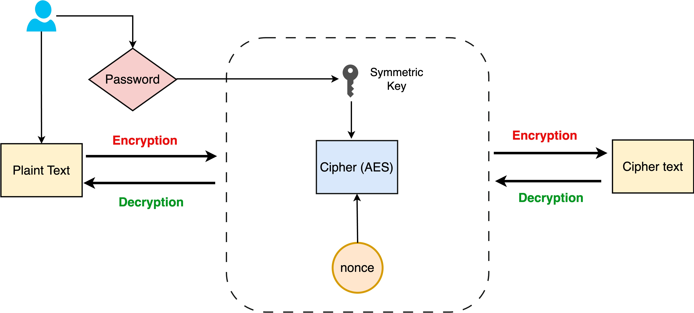

## Encrypter CLI Tool
### About
The Encrypter CLI tool, developed in Golang, enables file encryption and decryption using symmetric encryption techniques.

For encryption or decryption operations, the tool utilizes the crypto package, a built-in package in Go.



### Usage

#### Encryption of file

```sh
# Encrypts a file via CLI tool
./EncrypterCLI encrypt sample_file.txt
```

or

```sh
# Encrypts a file via go run cmd
go run main.go encrypt sample_file.txt
```

#### Decryption of file

```sh
# Decrypts a file via CLI tool
./EncrypterCLI decrypt sample_file.txt
```

or

```sh
# Decrypts a file via go run cmd
go run main.go decrypt sample_file.txt
```